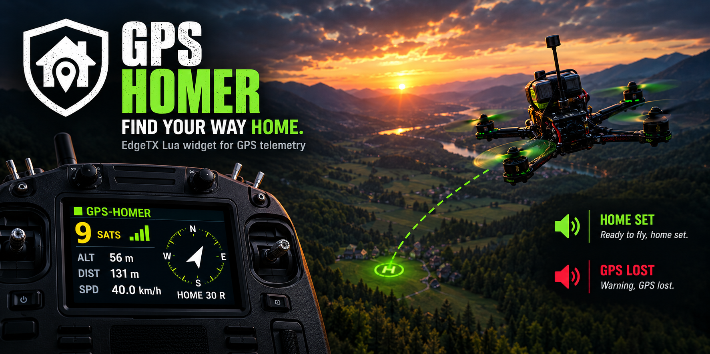
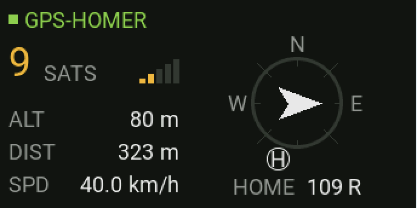

# edgetx-gps-homer



GPS Homer puts a **home arrow on your radio**: a small EdgeTX widget that always shows **which way home is and how far away it is**. It works with the GPS data your flight controller already sends to the radio. The arrow points **relative to the direction you are flying**. On top of that the radio tells you by voice when the GPS is ready, when home has been set and when the GPS signal is lost or back.

[](LICENSE)
[](https://edgetx.org)
[](https://www.expresslrs.org)
[](../../issues)
[](../../commits/main)
[](https://www.buymeacoffee.com/mariatorpro)

---

## 📑 Table of Contents

- [📋 Compatibility](#-compatibility)
- [🎯 What is it for?](#-what-is-it-for)
- [🧰 Requirements](#-requirements)
- [🧩 Script variants](#-script-variants)
- [📥 Installation](#-installation)
- [⚙️ Customizing](#️-customizing)
- [🛠️ Troubleshooting](#️-troubleshooting)
- [💡 Credits](#-credits)
- [🤝 Contributing](#-contributing)
- [⚠️ Disclaimer](#️-disclaimer)
- [📄 License](#-license)

---

## 📋 Compatibility

> [!CAUTION]
> **Testing is not finished yet.** The project is in an early stage and has not been through all real-flight tests. Feedback on how the individual functions behave on your setup is very welcome, please [open an issue](../../issues).

| Component | Minimum Version | Tested On | Test Hardware |
|-----------|-----------------|-----------|---------------|
| EdgeTX    | v2.11           | v2.12.4   | Radiomaster TX15, Radiomaster TX16S MK3 |
| ExpressLRS| v3.0            | v4.1.0    | Radiomaster RP1 V2, RP3 V2, RP4TD |

---

## 🎯 What is it for?

Which way is home? A model with GPS knows the answer at any moment, but the radio never shows it. GPS Homer brings the home arrow you know from the OSD in your goggles to the EdgeTX radio: one glance tells you where to turn and how far you have to go.

<p align="center">
  
</p>

The widget shows:

- **A home arrow** that points back to the launch position, seen from your current flight direction. Arrow up: keep going straight. Arrow down: turn around. Arrow left or right: turn that way. A compass ring around the arrow shows where north currently is.
- **The same hint in words** (`ahead`, `behind`, `30 R`, ...) and the **distance to home** (metres, or feet with imperial units).
- **The number of satellites** with a signal-style bar (red, yellow, green), plus altitude and ground speed.

Everything happens automatically:

- **Home is set on its own, exactly like in Betaflight.** Once the GPS has a solid fix for a few seconds the radio says "Ready to fly", and the moment you arm, the launch position is stored and the radio says "Home set". That is the same instant Betaflight sets its own home point, so the arrow on the radio and the arrow in the goggles always agree. Arm without a fix and there is no home for that flight, again just like Betaflight; land, disarm and arm again once the fix is there. (On a model that does not send its armed state, home is stored at the first stable fix instead.)
- **Voice only when it matters.** The radio speaks on four events (ready to fly, home set, GPS signal lost, GPS signal back). There are no continuous announcements, and each event can be muted or replaced with your own sound file.
- **Standing still or hovering slowly?** Without movement the GPS cannot tell which way the model is pointing, so the widget switches to the absolute direction instead (for example `SW 220°`). The arrow comes back as soon as the model moves.
- **Lost the link?** If the telemetry connection is gone for good (landed out of range, crash), the widget freezes and keeps showing the **last known GPS position** of the model to help you find it.

---

## 🧰 Requirements

- A radio running **EdgeTX 2.11 or newer**. For the widget the radio needs a color display; for voice announcements only, any EdgeTX radio will do (see [Script variants](#-script-variants)).
- A **Betaflight flight controller (4.0 or newer) with a GPS module**, with GPS telemetry enabled.
- An **ExpressLRS receiver** with telemetry enabled.
- The GPS data must be known to the radio as telemetry sensors. They appear on their own when you run a **telemetry discovery** (Model Settings → Telemetry → "Discover new sensors") while the GPS has a fix:
  - **Required:** `GPS` (position), `Sats` (satellite count), `GSpd` (ground speed), `Hdg` (course over ground)
  - **Optional:** `FM` (flight mode; tells the widget whether the model is armed so home is set at arming; without it home is set at the first stable fix), `Alt` or `GAlt` (altitude, display only) and `RQly` (link quality; if it is missing, the radio's own RSSI is used to detect a lost link)

The flight direction is taken from the GPS course over ground, which only exists while the model is moving. That is why the arrow needs a minimum ground speed of 6 km/h.

---

## 🧩 Script variants

GPS Homer comes in two variants. Both use the same logic and the same settings; you install **one** of them:

<table>
  <thead>
    <tr>
      <th width="24%"></th>
      <th width="38%">Widget</th>
      <th width="38%">Function script</th>
    </tr>
  </thead>
  <tbody>
    <tr>
      <td>Voice announcements (ready to fly, home set, GPS lost, GPS back) and vibration</td>
      <td>✅</td>
      <td>✅</td>
    </tr>
    <tr>
      <td>Home arrow, distance, satellites, last known position</td>
      <td>✅</td>
      <td>❌ (no display)</td>
    </tr>
    <tr>
      <td>Runs in the background</td>
      <td>✅ (keeps announcing even while another screen is shown)</td>
      <td>✅ (runs as a Special Function)</td>
    </tr>
    <tr>
      <td>Supported radios</td>
      <td>color-display radios only</td>
      <td>all EdgeTX radios, including black-and-white ones</td>
    </tr>
  </tbody>
</table>

> ⚠️ **Never run both at the same time**, otherwise every event is announced twice. The widget already includes everything the function script does. For the same reason, place the widget on **one screen only**.

---

## 📥 Installation

### 1. Copy the files to the SD card

Take the SD card out of the radio (or connect the radio via USB as mass storage) and copy the folders below 1:1 into the root of the card. Copying everything is fine even if you only use one variant; you choose the variant in step 2.

```
SCRIPTS/
├── GPSHOMER/
│   └── core.lua            ← shared logic (always required)
├── FUNCTIONS/
│   └── gpshom.lua          ← function-script variant (voice only)
└── TOOLS/
    └── GPSHOMER.lua        ← settings tool on the radio (optional)
WIDGETS/
└── GPSHOMER/
    └── main.lua            ← widget variant
SOUNDS/
└── en/
    └── scripts/
        └── GPSHOMER/
            ├── gpsready.wav        ← "Ready to fly"
            ├── gpsfix.wav          ← "Home set"
            ├── gpslost.wav         ← "GPS lost"
            └── gpsrec.wav          ← "GPS recovered"
```

All files sit in the same folders in this repository. The sound files always live under `/SOUNDS/en/scripts/GPSHOMER/`, no matter which language your radio is set to.

### 2a. Set up the widget

1. Put the SD card back into the radio and switch it on.
2. Open the model's **Telemetry / Display** setup (the page where you arrange the widget screens).
3. Pick a free zone, add a widget and choose **GPS Homer** from the list.
4. *(Optional)* Open the widget settings to adjust the look:
   - **Theme**: `Dark` or `Light`.
   - **Compass**: `NoseUp` (default) keeps your flight direction on top, the arrow points to home and the compass ring turns as you turn. `NorthUp` keeps north on top like a map, the arrow shows where you are flying and an `H` on the ring marks the direction to home.
   - **Transparency**: how milky the background overlay is (light theme only).
   - **Accent**: color of the heading text: `Default` (green), `Theme` (the focus color of your EdgeTX theme) or `Custom` (pick any color under **AccentColor**).

> 📐 **Which screen layout?** EdgeTX names its layouts `columns × rows`, so `2×4` means 2 zones side by side and 4 on top of each other. The widget is designed for a **half-width** zone and looks best in the layouts with **2 columns**:
>
> - **2×2**: half width, half height. This is the intended size and shows every value.
> - **2×3** and **2×4**: shorter zones. Speed and altitude are dropped first; satellites, distance and the arrow stay.
> - Very small zones show the arrow only.

### 2b. *(Alternative)* Set up the function script

For radios without a color display, or if you only want the voice announcements:

1. Put the SD card back into the radio and switch it on.
2. Open the **Model Settings** and go to the **Special Functions** page (also called "SF").
3. Pick a free slot and set it up like this:
   - **Switch / Condition:** `On` (the script runs permanently in the background)
   - **Action:** `Lua Script`
   - **Value / Script:** `gpshom`
   - **Repeat:** `On`
   - **Enable:** `On`
4. Leave the page; the settings are saved automatically.

### 3. Try it out

- Power the model, wait for the GPS fix and check on the radio's telemetry page that `GPS`, `Sats`, `GSpd` and `Hdg` show values.
- On the ground the widget shows `Searching satellites` with the satellite count and the number needed (for example `4 Sats (min 6)`). Once enough satellites are locked (6 by default) for a few seconds, the radio says "Ready to fly" and the widget switches to the live view with `READY TO FLY` under the compass ring; the home arrow and the distance are still missing.
- Arm the model: the radio says "Home set", and the arrow, the `H` on the ring (NorthUp) and the distance appear.
- Fly away from the launch position: the distance grows, and as soon as the model moves faster than 6 km/h the arrow appears and points back to the launch position.
- Switch the model off: after a moment the widget shows `Flight ended` with the last known coordinates, and after one minute it returns to `Waiting for telemetry`.
- With the function script you only hear the announcements: "Ready to fly" once the fix is stable, "Home set" when you arm, "GPS lost" and "GPS recovered" while flying.

---

## ⚙️ Customizing

All settings are changed on the radio with the bundled **settings tool**. Make sure `/SCRIPTS/TOOLS/GPSHOMER.lua` is on the SD card (see the file tree above) and open it via **SYS → Tools → "GPS Homer"**.

- **Settings**
  - **Min sats**: how many satellites must be locked before home is set, **4 to 20** (default 6). A higher number gives a more accurate launch position but sets home a little later.
  - **Sound** for each event (Ready to fly, Home set, GPS lost, GPS recover): `Default`, `Off`, or any `.wav` file you copied into `/SOUNDS/en/scripts/GPSHOMER/`. Every `.wav` in that folder shows up in the list, whatever its name. `Off` mutes only that one event.
  - **Test**: plays the sound currently selected in that row (and the vibration, if enabled) so you can compare sounds on the spot.
  - **Haptic feedback**: `Off` (default) or `On`. When on, the radio vibrates with every event, independent of the sound, so a muted event still vibrates. GPS lost gives two pulses, every other event one.
  - **Haptic strength**: `Soft`, `Normal` or `Strong` (only shown while haptic feedback is on).
  - **Units**: `Metric` (m, km/h, default) or `Imperial` (ft, mph). Altitude and speed are shown as the radio's sensors deliver them, so this only changes their labels; set the sensor units on the radio to match. The distance to home is computed from the coordinates and is converted to feet.
  - **Reset to defaults**: restores the factory settings.
- **About**: version number and the file locations used by the project.

Press **Save** to store the settings. They are written to `/SCRIPTS/GPSHOMER/config.lua` and picked up by both variants the next time the model is loaded (model switch or reboot). Without this file the built-in defaults are used, so the tool is optional.

Timing values such as the 6 km/h speed threshold or how long the last position is shown are deliberately not in the tool. If you need to change them, they are listed with comments at the top of `core.lua`.

---

## 🛠️ Troubleshooting

- **Widget shows "Core missing / Reinstall GPS Homer":** The file `/SCRIPTS/GPSHOMER/core.lua` is missing on the SD card. Copy it again from this repository.
- **Widget shows "No GPS sensor / Check FC config":** One of the required sensors (`GPS`, `Sats`, `GSpd`, `Hdg`) has never been discovered. Enable GPS telemetry in Betaflight, then run a telemetry discovery on the radio while the GPS has a fix.
- **Widget stays on "Searching satellites":** Not enough satellites yet, or the fix keeps dropping. Give the GPS a clear view of the sky; home is set once the satellite count stays at or above the threshold for a few seconds.
- **Widget shows `NO HOME` after arming, no "Home set" was spoken:** You armed before the GPS had enough satellites, so there is no home point for this flight (Betaflight has none either). Land, disarm, wait for "Ready to fly" and arm again.
- **"Ready to fly" and "Home set" always come together, before arming:** The radio does not know when the model is armed because the `FM` sensor is missing. Run a telemetry discovery to add it; until then home is stored at the first stable fix, and the model must not move before that.
- **No arrow, only a direction like "SW 220°":** The model is moving slower than 6 km/h, so the GPS cannot tell the flight direction yet. The arrow appears as soon as you fly.
- **Altitude shows "--":** Neither `Alt` nor `GAlt` is discovered. Altitude is optional; everything else keeps working.
- **No voice at all:** Check that the `.wav` files really are in `/SOUNDS/en/scripts/GPSHOMER/` (the `en` folder is required even if your radio uses another language). The quickest check is the settings tool: press **Test** on an event.
- **The function script is not offered in the Special Function list:** The file must be named exactly `gpshom.lua`. EdgeTX hides function scripts with more than 6 characters in their name.
- **A change to a `.lua` file has no effect on the radio:** Delete the compiled `.luac` file next to it; otherwise EdgeTX keeps running the old version.

---

## 💡 Credits

The way the home arrow is read follows the OSD home arrow in [Betaflight](https://betaflight.com), which most FPV pilots already know from their goggles.

---

## 🤝 Contributing

Found a bug or have an idea for an improvement? Please [open an issue](../../issues) on GitHub. Pull requests are welcome too.

---

## ⚠️ Disclaimer

This project is provided **as is** and is meant as an additional aid only. It does **not** replace careful flying within visual range, your own judgement, GPS rescue on the flight controller, or the safety mechanisms of your transmitter and receiver. Always be ready to react manually. Use at your own risk.

---

## 📄 License

Released under the [GNU General Public License v2.0](LICENSE).
