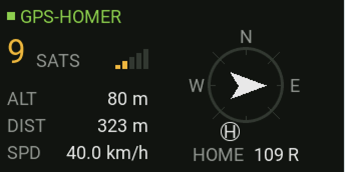

# edgetx-gps-homer


GPS Homer puts a **home arrow on your radio**: a small EdgeTX widget that shows **which way home is and how far away it is**, using the GPS data your flight controller already sends. On top of that the radio tells you by voice when the GPS is ready, when home has been set and when the GPS signal is lost or back.

[](LICENSE)
[](https://edgetx.org)
[](https://www.expresslrs.org)
[](../../issues)
[](../../commits/main)
[](https://www.buymeacoffee.com/mariatorpro)

---

## 📑 Table of Contents

- [📋 Compatibility](#-compatibility)
- [🎯 What is it for?](#-what-is-it-for)
- [🧰 Requirements](#-requirements)
- [🧩 Script variants](#-script-variants)
- [📥 Installation](#-installation)
- [⚙️ Customizing](#️-customizing)
- [🛠️ Troubleshooting](#️-troubleshooting)
- [🤝 Contributing](#-contributing)
- [⚠️ Disclaimer](#️-disclaimer)
- [📄 License](#-license)

---

## 📋 Compatibility

> [!CAUTION]
> **Testing is not finished yet.** The project is in an early stage and has not been through all real-flight tests. Feedback on how the individual functions behave on your setup is very welcome, please [open an issue](../../issues).

| Component | Minimum Version | Tested On | Test Hardware |
|-----------|-----------------|-----------|---------------|
| EdgeTX    | v2.11           | v2.12.4   | Radiomaster TX15, Radiomaster TX16S MK3 |
| ExpressLRS| v3.0            | v4.1.0    | Radiomaster RP1 V2, RP3 V2, RP4TD |

> Flight controllers (Betaflight, INAV, ArduPilot), other RC links (TBS Crossfire, ImmersionRC Ghost, FrSky ACCESS) and the settings they need: see [`docs/compatibility.md`](docs/compatibility.md).
>
> 🙋 **Help wanted:** most of these combinations are checked in the source code only, not yet on real hardware. If you fly one of them, a test would help a lot. Any feedback, working or not, is welcome: please [open an issue](../../issues).

---

## 🎯 What is it for?

Which way is home? A model with GPS knows the answer at any moment, but the radio never shows it. GPS Homer brings the home arrow you know from the OSD in your goggles to the EdgeTX radio: one glance tells you where to turn and how far you have to go.

<p align="center">
  
</p>

The widget shows:

- **A home arrow** relative to your flight direction: up means straight on, down means turn around, left or right means turn that way. A compass ring around it shows north.
- **The same hint in words** (`ahead`, `behind`, `30 R`, ...) and the **distance to home**.
- **The number of satellites** with a signal bar, plus altitude above home and ground speed.
- **GPS accuracy on the ground** (`PDOP 1.3`, with INAV and ArduPilot `HDOP`) in place of altitude and distance until you arm.

Everything happens automatically:

- **Home is set on its own, like on the flight controller.** Once the GPS fix is stable the radio says "Ready to fly"; when you arm, home is stored and the radio says "Home set".
- **Voice only when it matters:** ready to fly, home set, GPS lost, GPS back. Each event can be muted or replaced with your own sound.
- **Standing still or hovering slowly?** The compass ring turns north up and an `H` on it marks the direction to home (`SW 220°`), since there is no flight direction yet.
- **Lost the link?** The widget keeps showing the **last known GPS position** of the model to help you find it.

---

## 🧰 Requirements

- A radio running **EdgeTX 2.11 or newer**. For the widget the radio needs a color display; for voice announcements only, any EdgeTX radio will do (see [Script variants](#-script-variants)).
- A **Betaflight, INAV or ArduPilot flight controller with a GPS module**, with GPS telemetry enabled. INAV and ArduPilot support is derived from their source code and not flight-tested yet; ArduPilot needs one extra setting, see [`docs/compatibility.md`](docs/compatibility.md#setup).
- An **ExpressLRS receiver (3.0 or newer)** with telemetry enabled.
- The GPS data must be known to the radio as telemetry sensors. They appear on their own when you run a **telemetry discovery** (Model Settings → Telemetry → "Discover new sensors") while the GPS has a fix:
  - **Required:** `GPS` (position), `Sats` (satellite count), `GSpd` (ground speed), `Hdg` (course over ground). A lost link is detected by the radio itself, no sensor needed.
  - **Optional:**
    - `FM` (flight mode): sets home at arming; without it, home is set at the first stable fix
    - `Alt` or `GAlt`: altitude, display only

---

## 🧩 Script variants

GPS Homer comes in two variants. Both use the same logic and the same settings; you install **one** of them:

<table>
  <thead>
    <tr>
      <th width="24%"></th>
      <th width="38%">Widget</th>
      <th width="38%">Function script</th>
    </tr>
  </thead>
  <tbody>
    <tr>
      <td>Voice announcements and vibration</td>
      <td>✅</td>
      <td>✅</td>
    </tr>
    <tr>
      <td>Home arrow, distance, satellites, last known position</td>
      <td>✅</td>
      <td>❌ (no display)</td>
    </tr>
    <tr>
      <td>Runs in the background</td>
      <td>✅</td>
      <td>✅</td>
    </tr>
    <tr>
      <td>Supported radios</td>
      <td>color-display radios only</td>
      <td>all EdgeTX radios, including black-and-white ones</td>
    </tr>
  </tbody>
</table>

> ⚠️ **Never run both at the same time**, otherwise every event is announced twice. The widget already includes everything the function script does. For the same reason, place the widget on **one screen only**.

---

## 📥 Installation

### 1. Copy the files to the SD card

Copy the folders below 1:1 into the root of the SD card. Copying everything is fine even if you only use one variant; you choose the variant in step 2.

```
SCRIPTS/
├── GPSHOMER/
│   ├── core.lua            ← shared logic (always required)
│   └── qr.lua              ← QR code for the settings tool (optional)
├── FUNCTIONS/
│   └── gpshom.lua          ← function-script variant (voice only)
└── TOOLS/
    └── GPSHOMER.lua        ← settings tool on the radio (optional)
WIDGETS/
└── GPSHOMER/
    └── main.lua            ← widget variant
SOUNDS/
└── en/
    └── SCRIPTS/
        └── GPSHOMER/
            ├── gpsready.wav        ← "Ready to fly"
            ├── gpsfix.wav          ← "Home set"
            ├── gpslost.wav         ← "GPS lost"
            └── gpsrec.wav          ← "GPS recovered"
```

All files sit in the same folders in this repository. The sound files always live under `/SOUNDS/en/SCRIPTS/GPSHOMER/`, no matter which language your radio is set to.

Two more files show up in `/SCRIPTS/GPSHOMER/` later, written by the radio itself and nothing you copy: `config.lua` holds your settings once you save them in the tool, and `flights.lua` holds the last three landing positions.

### 2a. Set up the widget

1. Open the model's **Telemetry / Display** setup (the page where you arrange the widget screens).
2. Pick a free zone, add a widget and choose **GPS Homer** from the list.
3. *(Optional)* Open the widget settings to adjust the look:
   - **Theme**: `Dark` or `Light`.
   - **Compass**: `NoseUp` (default): flight direction on top, the arrow points home. `NorthUp`: north on top like a map, an `H` on the ring marks home.
   - **Transparency**: how much of the radio theme shows through the milky background (light theme only): `0%` opaque, `100%` no overlay.
   - **Accent**: color of the heading text: `Default` (green), `Theme` (the focus color of your EdgeTX theme) or `Custom` (pick any color under **AccentColor**).

> 📐 **Which screen layout?** EdgeTX names its layouts `columns × rows`, so `2×4` means 2 zones side by side and 4 on top of each other. The widget is designed for a **half-width** zone and looks best in the layouts with **2 columns**:
>
> - **2×2**: half width, half height. This is the intended size and shows every value.
> - **2×3** and **2×4**: shorter zones. Speed and altitude are dropped first; satellites, distance and the arrow stay.
> - Very small zones show the arrow only.

### 2b. *(Alternative)* Set up the function script

For radios without a color display, or if you only want the voice announcements:

1. Open the **Model Settings** and go to the **Special Functions** page (also called "SF").
2. Pick a free slot and set it up like this:
   - **Switch / Condition:** `On` (the script runs permanently in the background)
   - **Action:** `Lua Script`
   - **Value / Script:** `gpshom`
   - **Repeat:** `On`
   - **Enable:** `On`
3. Leave the page; the settings are saved automatically.

### 3. Try it out

- Power the model and wait for the GPS fix. The radio's telemetry page should show values for `GPS`, `Sats`, `GSpd` and `Hdg`.
- The widget shows `Searching satellites` (e.g. `4 Sats (min 6)`). Once the fix is stable, the radio says "Ready to fly" and the widget shows `READY TO FLY`.
- Arm the model: the radio says "Home set". Fly away: the distance grows and the arrow points back home.
- Switch the model off: the widget shows `Flight ended` with the last known coordinates. They stay in the flight log, see **Last flights** in the settings tool.
- With the function script you only hear the announcements.

---

## ⚙️ Customizing

All settings are changed on the radio with the bundled **settings tool**. Make sure `/SCRIPTS/TOOLS/GPSHOMER.lua` is on the SD card (see the file tree above) and open it via **SYS → Tools → "GPS Homer"**.

- **Settings**
  - **Min sats**: how many satellites must be locked before home is set, **4 to 20** (default 6). A higher number gives a more accurate launch position but sets home a little later.
  - **Sound** for each event (Ready to fly, Home set, GPS lost, GPS recover): `Default`, `Off`, or any `.wav` file you copied into the sounds folder from the file tree above. Every `.wav` in that folder shows up in the list, whatever its name. `Off` mutes only that one event.
  - **Test**: plays the sound currently selected in that row (and the vibration, if enabled) so you can compare sounds on the spot.
  - **Haptic feedback**: `Off` (default) or `On`. When on, the radio vibrates with every event, independent of the sound, so a muted event still vibrates. GPS lost gives two pulses, every other event one.
  - **Haptic strength**: `Soft`, `Normal` or `Strong` (only shown while haptic feedback is on).
  - **Units**: `Metric` (m, km/h, default) or `Imperial` (ft, mph). Set the units of the altitude and speed sensors on the radio to match.
  - **GPS accuracy**: `On` (default) or `Off`.
  - **Reset to defaults**: restores the factory settings and clears the flight log.
- **Last flights**: where the model was when the telemetry ended, for the last three flights. Each entry shows date, time, model name and the coordinates, next to a **QR code**. Scan it with a phone and the map app opens on that spot. The roller steps from the newest flight back to the oldest.
- **About**: version number and the file locations used by the project.

Press **Save** to store the settings. They take effect the next time the model is loaded (model switch or reboot). Without saved settings the defaults apply, so the tool is optional.

---

## 🛠️ Troubleshooting

- **Widget shows "No GPS sensor / Check FC config":** One of the required sensors (`GPS`, `Sats`, `GSpd`, `Hdg`) has never been discovered. Enable GPS telemetry on the flight controller, then run a telemetry discovery on the radio while the GPS has a fix.
- **Widget stays on "Searching satellites":** Not enough satellites yet, or the fix keeps dropping. Give the GPS a clear view of the sky, away from buildings and the car.
- **Widget shows `NO HOME` after arming, no "Home set" was spoken:** You armed before the GPS had enough satellites, so there is no home point for this flight. Land, disarm, wait for "Ready to fly" and arm again.
- **"Ready to fly" and "Home set" always come together, before arming:** The radio does not know when the model is armed because the `FM` sensor is missing. Run a telemetry discovery to add it; until then home is stored at the first stable fix, and the model must not move before that.
- **No arrow, only a direction like "SW 220°":** The model is moving slower than 6 km/h, so the GPS cannot tell the flight direction yet. The arrow appears as soon as you fly.
- **No voice at all:** Check that the `.wav` files really are in `/SOUNDS/en/SCRIPTS/GPSHOMER/` (the `en` folder is required even if your radio uses another language). The quickest check is the settings tool: press **Test** on an event.
- **A screen reports a missing file:** Copy the folders from this repository again, the file tree above lists everything that belongs on the card.

---

## 🤝 Contributing

Found a bug or have an idea for an improvement? Please [open an issue](../../issues) on GitHub. Pull requests are welcome too.

---

## ⚠️ Disclaimer

This project is provided **as is** and is meant as an additional aid only. It does **not** replace careful flying within visual range, your own judgement, GPS rescue on the flight controller, or the safety mechanisms of your transmitter and receiver. Always be ready to react manually. Use at your own risk.

---

## 📄 License

Released under the [GNU General Public License v2.0](LICENSE).
